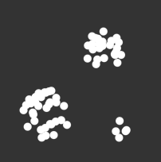
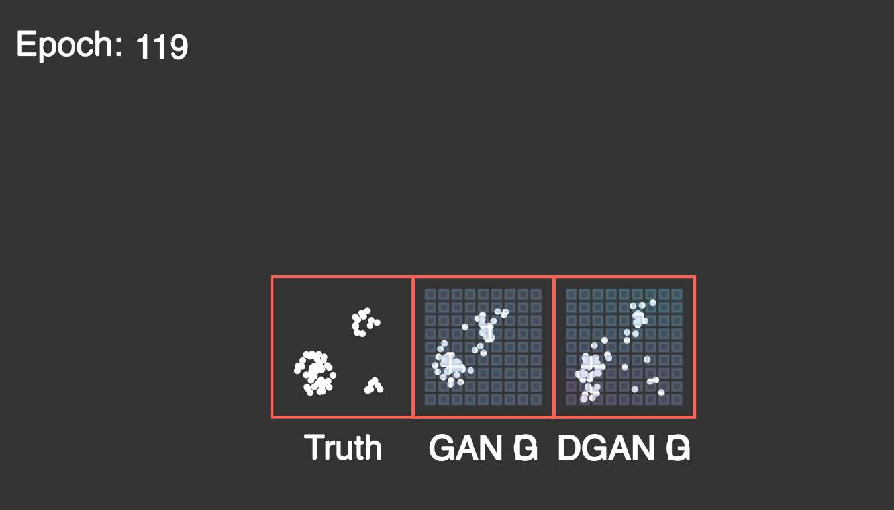

# Distribution Generative Adversarial Network

## Summary and Motivation
[GANs][1] (a type of machine learning model that uses two competing neural networks to generate content that matches the style of the user provided data) commonly suffer from a problem called mode collapse. Essentially, if the end goal for the GAN is to create images of digits, it ends up only displaying, for example, 3, 4, and 6. Technically, this satisfies the request. However, it clearly isn't optimal. Mode collapse, more formally, can be defined as the generator fooling the discriminator by only mimicking a subset of the input data, as opposed to outputing results that capture the entirety of the input data set.

To partially remedy this problem, a discriminator that takes multiple data points is proposed. The name of the combined model is a Distribution Generative Adversarial Network (DGAN for short).
## Description

The key problem that causes mode collapse is that the discriminator only has one generator output to look at. This allows the generator to be a "one-shot wonder" and not have to diversify itself. 

This can be solved by sending more than one generator output to the discriminator. For an analogy, the more masterpieces a person presents, the easier it is to determine if they are a true artist. Likewise, the discriminator having more than one more data point allows it to be more confident. If the discriminator receives ten independently created digit images and they're all ones, it can be reasonably confident that the data is not real. Therefore, the generator can no longer use mode collapse as an excuse to be lazy!

Other theoretical benefits include the fact the distribution is matched at all levels. Essentially, the generator is now encouraged to produce all classes of the dataset (say all ten digits). Within each class, the subdistribution is also matched (which corresponds with all possible handwriting styles of that digit being represented). 

The last important detail is that the discriminator is sent multiple data points regardless of the data points being from the generator or the true data set. The inputted data for each run should all be fake or all be real (as the discriminator still only outputs a single bit answer). If the data is true, the individual samples should be independently sampled from the greater training set. This is opposed to copying the same data point C times.

To determine the amount of data points sent to the generator, a reasonable metric would be to use some multiple of the ceiling of the entropy of the distribution (granted this only works if the probability distribution is known beforehand). That is 

$$ C = \lceil \alpha \sum_{x \in D} -\log_2(p(x)) \cdot p(x) \rceil $$ 

The alpha could be repurposed to be the base of the logarithm, though this a matter of preference. Regardless, the equation ensures that with more classes, the discriminator is sent more information. Although, 'C' could just as easily be considered a hyperparameter by itself.

In context of this project, the DGAN is tested on a rather simple example: output a 2D point that is inline with a given distribution. 



One important note is that the generator is outputting a single point (not the entire picture). The image, on the other hand, shows the entirety of the data set, which is hoped to be produced by the generator over many individual runs. Also, the previous claims in the third paragraph can be connected to this simple example. It is expected that the generator targets all three "clusters." From there, it also expected that the generator creates circles (as opposed to just congregating points in the center of each cluster). 

An important caveat is that DGANs likely increase the likelihood of overfitting.

The name "Distribution GAN" comes from the fact that the GAN is incentivized to match the entirety of the input distribution, rather than just focusing on matching individual entries.

## Implementation
In terms of implementation, there's surprisingly little to add on top of a vanilla GAN. All that's needed is to 
1. Change the fake input to the discriminator from ```gen_res = gan_gen_nn(random_seed)``` to ```gen_res = tf.concat([dgan_gen_nn(random_seed[x]) for x in range(DGAN_COMPARE_ENTRIES)], axis = 1)``` For this, the random seed also needs an extra dimension.
2. Modify the real input vector to the discriminator by including multiple training data points, instead of a single data point (each batch still has multiple entries, it's just that each input vector has multiple data points itself). The operation can be done efficiently with a simple reshape command.

For specific implementation details, check out the ```nn.py``` file.

## Run
To run the visualization (which displays results of each epoch), use: ```python3 -m manimlib visualize.py``` 

Do note that the visualization file
1. Is written rather sloppily 
2. Requires the [manimgl][2] python library (manimce *should* work if the user is fine with a video output, though it hasn't been tested). 

For just training, use ```python3 train.py``` If no visualization is required, tensorflow (version 2) and numpy are the only dependecies.

## Results
Below, is a snippet from training. 



Unfortunately, the DGAN does not appear to perform all that well, especially for the amount of epochs. In fact, it may have even been worse in performance compared with a regular GAN. Granted, the GAN didn't perform all that well either, so there may be an underlying problem in the code that is affecting the two.

Realistically, the DGAN does not appear to adequately counter mode collapse (at least not to a statistically significant degree). At the time of this writing, the details of the malperformance are not known to the author. Also at the time of this writing, no quantative measures were recorded regarding the performance (except for generator/discriminator loss).

## Future
Admittedly, not a lot of work was done tuning the hyperparameters. Trying a different amount of entries sent to the discriminator used would probably be the first option (for reference, four was the number used). 

Additionally, it would be wise to experiment on a GAN with a more practical use (e.g. mnist), where the problem of mode collapse is more rampant. 

[1]: <https://arxiv.org/abs/1406.2661> "GANs"
[2]: <https://3b1b.github.io/manim/getting_started/installation.html> "manimgl"
